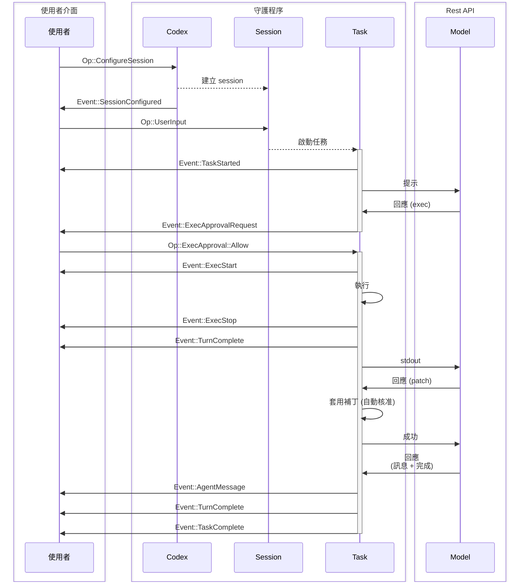
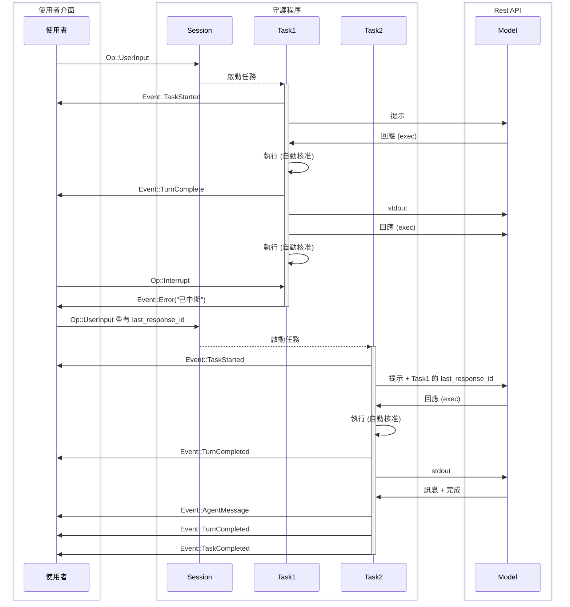

在 [protocol.rs](../core/src/protocol.rs) 和 [agent.rs](../core/src/agent.rs) 中定義的協定總覽。

本文件的目標是定義系統中使用的術語，並解釋系統的預期行為。

注意：程式碼可能與本規格不完全相符。在本規格審核後，需要進行一些小幅變更，這些變更不會改變現有 TUI 的功能。

## 實體

這些是存在於 codex 後端的實體。本節旨在建立詞彙表，並為 `Codex` 核心系統建構一個共享的心智模型。

0. `Model`
   - 在我們的案例中，這是指 Responses REST API
1. `Codex`
   - codex 的核心引擎
   - 在本機執行，可在背景執行緒或獨立程序中運作
   - 透過一對佇列進行通訊 – SQ（提交佇列）/ EQ（事件佇列）
   - 接收使用者輸入，向 `Model` 發出請求，執行指令並套用補丁。
2. `Session`
   - `Codex` 當前的組態與狀態
   - `Codex` 啟動時沒有 `Session`，它由 `Op::ConfigureSession` 初始化，這應該是 UI 發送的第一個訊息。
   - 當前的 `Session` 可以透過額外的 `Op::ConfigureSession` 呼叫來重新組態。
   - 當 session 重新組態時，任何執行中的任務都會被中止。
3. `Task`
   - `Task` 是 `Codex` 為回應使用者輸入而執行的工作。
   - `Session` 一次最多只能有一個 `Task` 在執行。
   - 接收到 `Op::UserInput` 會啟動一個 `Task`
   - 由一系列的 `Turn` 組成
   - `Task` 會一直執行，直到：
     - `Model` 完成任務，且沒有輸出可供下一個 `Turn` 使用
     - 額外的 `Op::UserInput` 會中止當前任務並啟動一個新任務
     - UI 透過 `Op::Interrupt` 中斷
     - 遇到致命錯誤，例如 `Model` 連線超過重試次數限制
     - 因等待使用者核准而被阻擋（執行指令或補丁）
4. `Turn`
   - `Task` 中的一個迭代循環，包含：
     - 向 `Model` 發出請求 - （初始時）提示 + （可選）`last_response_id`，或（在迴圈中）前一個 turn 的輸出
     - `Model` 透過 SSE 以串流方式傳回回應，這些回應會被收集直到收到「completed」訊息且 SSE 終止
     - `Codex` 接著執行指令、套用補丁，並輸出 `Model` 回傳的訊息
     - 在必要時暫停以請求核准
   - 一個 `Turn` 的輸出是下一個 `Turn` 的輸入
   - 若一個 `Turn` 沒有產生任何輸出，則 `Task` 會終止

「UI」一詞用來指稱驅動 `Codex` 的應用程式。这可能是使用者操作的 CLI / TUI 聊天式介面，也可能是像 VSCode 擴充功能這樣的 GUI 介面。UI 位於 `Codex` 外部，因為 `Codex` 的設計是為了能由任意的 UI 實作來操作。

當一個 `Turn` 完成時，來自 `Model` 最終 `response.completed` 訊息的 `response_id` 會被儲存在 `Session` 狀態中，以便在下一次收到 `Op::UserInput` 時續行該執行緒。`response_id` 也會透過 `EventMsg::TurnComplete` 回傳給 UI，UI 可以在 `Op::UserInput` 中提供此 ID，從而從較早的時間點分支出執行緒。

由於一次只能執行 1 個 `Task`，對於平行任務，建議為每個工作執行緒執行一個獨立的 `Codex`。

## 介面

- `Codex`
  - 透過 `SQ`（提交佇列）和 `EQ`（事件佇列）與 UI 通訊。
- `Submission`
  - 這些是在 `SQ` 上傳送的訊息（UI -> `Codex`）
  - 具有一個由 UI 提供的字串 ID，稱為 `sub_id`
  - `Op` 指的是所有可能的 `Submission` 承載資料的列舉
    - 此列舉是 `non_exhaustive`；未來可能會新增其他變體
- `Event`
  - 這些是在 `EQ` 上傳送的訊息（`Codex` -> UI）
  - 每個 `Event` 都有一個非唯一的 ID，與啟動當前任務的 `Op::UserInput` 中的 `sub_id` 相符。
  - `EventMsg` 指的是所有可能的 `Event` 承載資料的列舉
    - 此列舉是 `non_exhaustive`；未來可能會新增其他變體
    - 應預期未來會陸續新增 `EventMsg` 變體，以揭露更多關於模型行為的詳細資訊。

關於 `Op` 和 `EventMsg` 變體的完整文件，請參考 [protocol.rs](../core/src/protocol.rs)。以下是一些承載資料類型的範例：

- `Op`
  - `Op::UserInput` – 任何來自使用者用以啟動 `Task` 的輸入
  - `Op::Interrupt` – 中斷一個執行中的任務
  - `Op::ExecApproval` – 核准或拒絕程式碼執行
- `EventMsg`
  - `EventMsg::AgentMessage` – 來自 `Model` 的訊息
  - `EventMsg::ExecApprovalRequest` – 請求使用者核准以執行一個指令
  - `EventMsg::TaskComplete` – 一個任務成功完成
  - `EventMsg::Error` – 一個任務因錯誤而停止
  - `EventMsg::TurnComplete` – 包含一個 `response_id` 書籤，指向任務執行的最後一個 `response_id`。這可以用於在稍後的時間點，可能加上額外的使用者輸入，來續行任務。

每個任務回傳的 `response_id` 與儲存在 API 的 `/responses` 端點中的 OpenAI `response_id` 相符。它可以被儲存並在未來的 `Sessions` 中用來續行工作執行緒。

## 傳輸

可在任何支援雙向串流的傳輸協定上運作。 - 跨執行緒通道 - IPC 通道 - stdin/stdout - TCP - HTTP2 - gRPC

非框架式傳輸，例如 stdin/stdout 和 TCP，在傳送訊息時應使用換行符分隔的 JSON。

## 範交流程

常見互動的序列圖範例。為了簡潔起見，每個圖中都可能省略了一些不重要的事件。

### 基本 UI 流程

單一使用者輸入，接著是一個 2-turn 的任務

### 任務中斷

中斷一個任務並以額外的使用者輸入續行。

