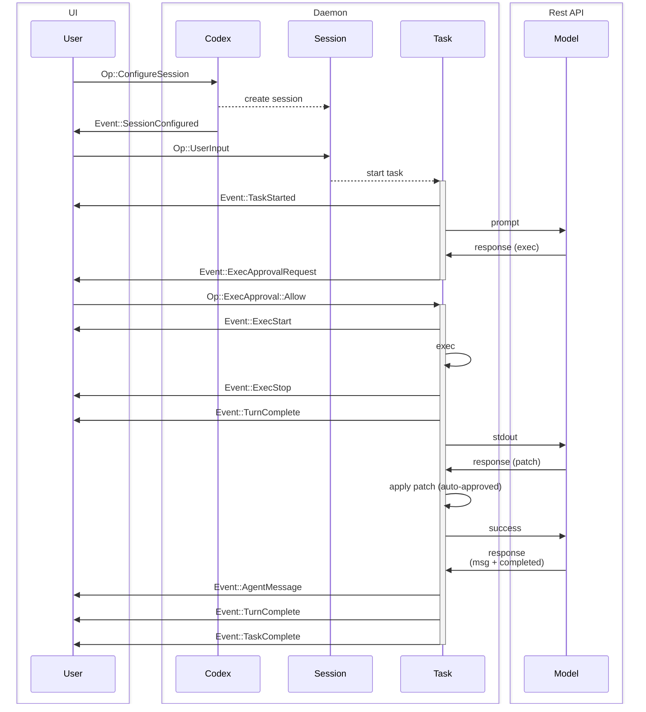
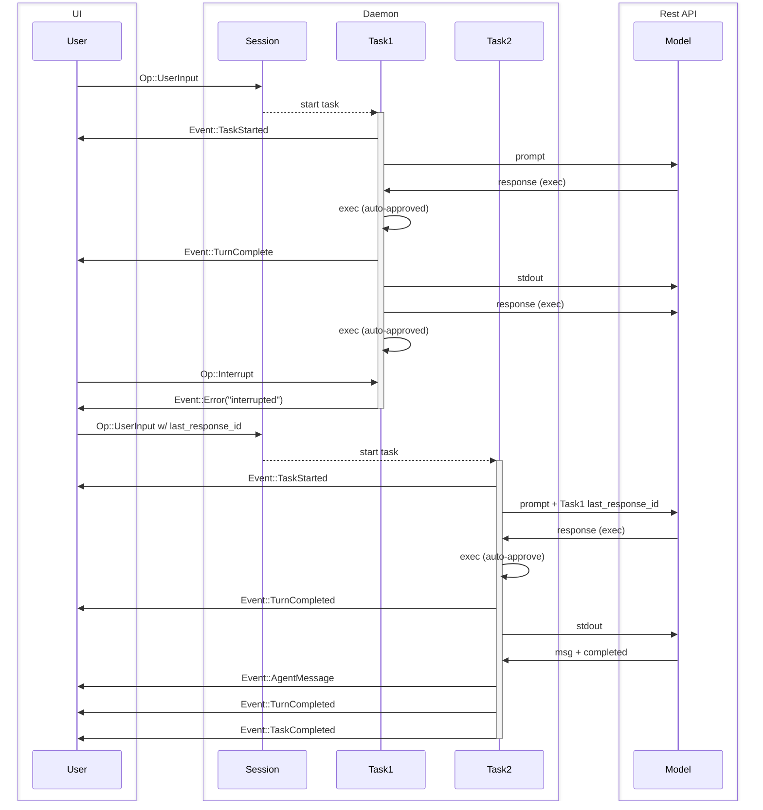

在 [protocol.rs](../core/src/protocol.rs) 和 [agent.rs](../core/src/agent.rs) 中定義的協定概述。

本文件的目標是定義系統中使用的術語，並說明系統的預期行為。

注意：程式碼可能不完全符合此規格。在此規格經過審查後，需要進行一些小的變更，但不會影響現有 TUI 的功能。

## 實體

這些是存在於 codex 後端的實體。本節的目的是建立詞彙表並為 `Codex` 核心系統構建共同的心理模型。

0. `Model`
   - 在我們的情況下，這是 Responses REST API
1. `Codex`
   - codex 的核心引擎
   - 在本地執行，可以在背景執行緒或獨立程序中執行
   - 透過佇列對進行通訊 – SQ（提交佇列）/ EQ（事件佇列）
   - 接收使用者輸入，向 `Model` 發出請求，執行命令並套用修補程式。
2. `Session`
   - `Codex` 的目前設定和狀態
   - `Codex` 開始時沒有 `Session`，由 `Op::ConfigureSession` 初始化，這應該是 UI 發送的第一個訊息。
   - 目前的 `Session` 可以透過額外的 `Op::ConfigureSession` 呼叫重新設定。
   - 當會話重新設定時，任何正在執行的執行都會被中止。
3. `Task`
   - `Task` 是 `Codex` 回應使用者輸入而執行的工作。
   - `Session` 一次最多只能執行一個 `Task`。
   - 接收 `Op::UserInput` 會開始一個 `Task`
   - 由一系列 `Turn` 組成
   - `Task` 執行直到：
     - `Model` 完成任務且沒有輸出可供進入額外的 `Turn`
     - 額外的 `Op::UserInput` 中止目前任務並開始新任務
     - UI 使用 `Op::Interrupt` 中斷
     - 遇到致命錯誤，例如 `Model` 連線超過重試限制
     - 被使用者核准阻擋（執行命令或修補程式）
4. `Turn`
   - `Task` 中的一個迭代週期，包含：
     - 對 `Model` 的請求 -（初始）提示 +（可選）`last_response_id`，或（在迴圈中）前一輪輸出
     - `Model` 在 SSE 中串流回應，直到收集到「completed」訊息且 SSE 終止
     - `Codex` 然後執行命令、套用修補程式，並輸出 `Model` 回傳的訊息
     - 必要時暫停以請求核准
   - 一個 `Turn` 的輸出是下一個 `Turn` 的輸入
   - 產生無輸出的 `Turn` 會終止 `Task`

術語「UI」用於指代驅動 `Codex` 的應用程式。這可能是使用者操作的 CLI / TUI 聊天式介面，或者可能是像 VSCode 擴充功能之類的 GUI 介面。UI 是 `Codex` 外部的，因為 `Codex` 旨在由任意 UI 實作操作。

當 `Turn` 完成時，來自 `Model` 最終 `response.completed` 訊息的 `response_id` 會儲存在 `Session` 狀態中，以便在下一個 `Op::UserInput` 時恢復執行緒。`response_id` 也會在 `EventMsg::TurnComplete` 中回傳給 UI，可以透過在 `Op::UserInput` 中提供它來從較早的點分叉執行緒。

由於一次只能執行 1 個 `Task`，對於並行任務，建議為每個工作執行緒執行單一的 `Codex`。

## 介面

- `Codex`
  - 透過 `SQ`（提交佇列）和 `EQ`（事件佇列）與 UI 通訊。
- `Submission`
  - 這些是在 `SQ` 上發送的訊息（UI -> `Codex`）
  - 具有由 UI 提供的字串 ID，稱為 `sub_id`
  - `Op` 指所有可能的 `Submission` 負載的列舉
    - 此列舉是 `non_exhaustive`；變體可以在未來的日期新增
- `Event`
  - 這些是在 `EQ` 上發送的訊息（`Codex` -> UI）
  - 每個 `Event` 都有一個非唯一的 ID，與啟動目前任務的 `Op::UserInput` 的 `sub_id` 相符。
  - `EventMsg` 指所有可能的 `Event` 負載的列舉
    - 此列舉是 `non_exhaustive`；變體可以在未來的日期新增
    - 應該預期會隨著時間新增新的 `EventMsg` 變體，以公開模型動作的更詳細資訊。

有關 `Op` 和 `EventMsg` 變體的完整文件，請參考 [protocol.rs](../core/src/protocol.rs)。一些範例負載類型：

- `Op`
  - `Op::UserInput` – 使用者的任何輸入以啟動 `Task`
  - `Op::Interrupt` – 中斷正在執行的任務
  - `Op::ExecApproval` – 核准或拒絕程式碼執行
- `EventMsg`
  - `EventMsg::AgentMessage` – 來自 `Model` 的訊息
  - `EventMsg::ExecApprovalRequest` – 請求使用者核准執行命令
  - `EventMsg::TaskComplete` – 任務成功完成
  - `EventMsg::Error` – 任務因錯誤而停止
  - `EventMsg::TurnComplete` – 包含任務執行的最後 `response_id` 的書籤。這可以用於在稍後的時間點繼續任務，也許附加額外的使用者輸入。

從每個任務回傳的 `response_id` 與儲存在 API 的 `/responses` 端點中的 OpenAI `response_id` 相符。它可以被儲存並在未來的 `Sessions` 中使用以恢復工作執行緒。

## 傳輸

可以在任何支援雙向串流的傳輸上運作。- 跨執行緒通道 - IPC 通道 - stdin/stdout - TCP - HTTP2 - gRPC

非幀傳輸，如 stdin/stdout 和 TCP，應該在發送訊息時使用換行符分隔的 JSON。

## 範例流程

常見互動的序列圖範例。在每個圖表中，某些不重要的事件可能為了簡化而被省略。

### 基本 UI 流程

單一使用者輸入，接著是 2 輪任務

### 任務中斷

中斷任務並繼續額外的使用者輸入。

