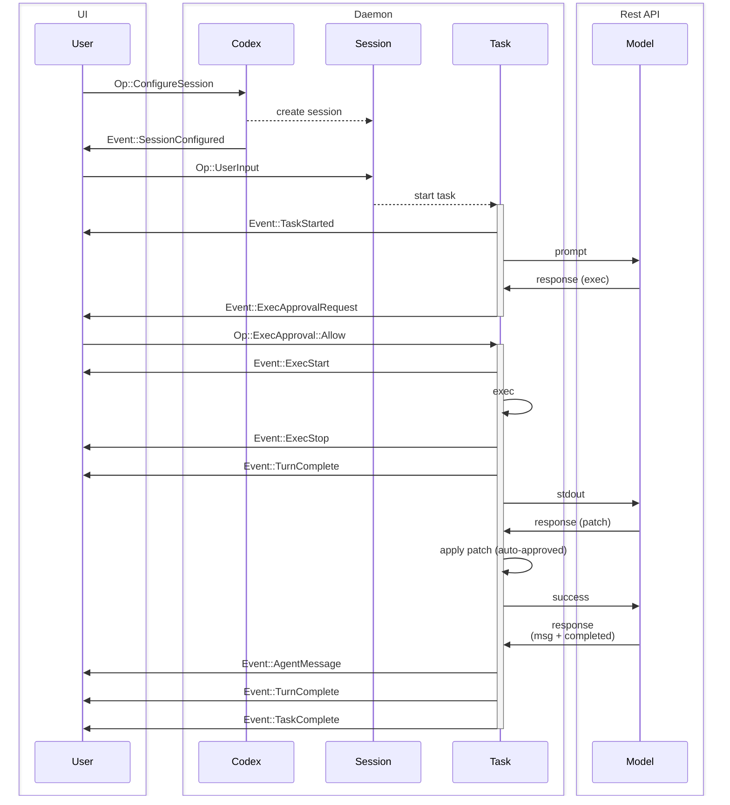
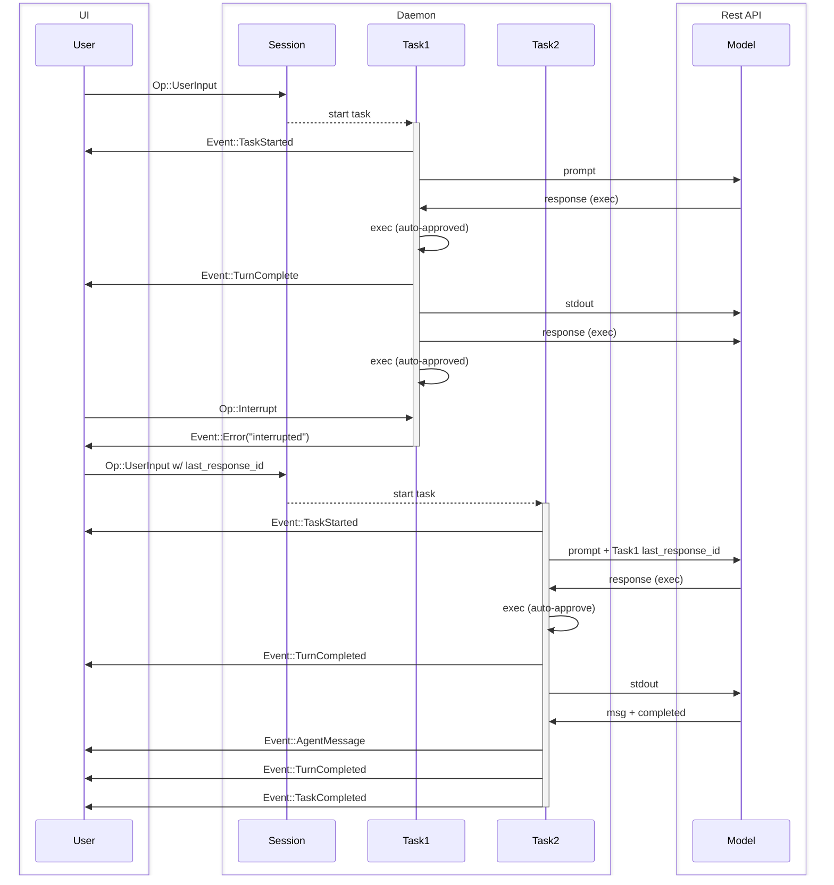

概述：本文件說明 [protocol.rs](../core/src/protocol.rs) 與 [agent.rs](../core/src/agent.rs) 中所定義的協定。

本文件的目標是定義系統中使用的術語，並解釋系統的預期行為。

注意：程式碼可能尚未完全符合本規格。此規格審閱後會進行少量更動，但不會影響現有 TUI 的功能。

## 實體（Entities）

以下為 Codex 後端的實體。本節旨在建立共同術語，並為 `Codex` 核心系統建立共享心智模型。

0. `Model`
   - 在本系統中，指 Responses REST API。
1. `Codex`
   - Codex 的核心引擎。
   - 在本機執行，可為背景執行緒或獨立行程。
   - 透過一對佇列溝通——SQ（Submission Queue）/ EQ（Event Queue）。
   - 接收使用者輸入、向 `Model` 送出請求、執行指令並套用修補。
2. `Session`
   - `Codex` 目前的組態與狀態。
   - `Codex` 初始沒有 `Session`，由 `Op::ConfigureSession` 初始化——這應是 UI 傳送的第一則訊息。
   - 之後可再以 `Op::ConfigureSession` 重新設定目前 `Session`。
   - 重新設定時，任何正在執行的流程會被中止。
3. `Task`
   - `Task` 是 `Codex` 對使用者輸入所執行的工作。
   - `Session` 同一時間最多只有一個 `Task` 在執行。
   - 收到 `Op::UserInput` 會啟動一個 `Task`。
   - 由一連串 `Turn` 組成。
   - `Task` 執行直到：
     - `Model` 完成任務，且沒有輸出可再交給下一個 `Turn`；或
     - 另一次 `Op::UserInput` 中止目前任務並啟動新任務；或
     - UI 以 `Op::Interrupt` 介入；或
     - 發生致命錯誤，例如 `Model` 連線重試次數用罄；或
     - 等待使用者核准（執行指令或套用修補）。
4. `Turn`
   - `Task` 中的一次迭代，包含：
     - 向 `Model` 發出請求——（初次）提示 +（可選）`last_response_id`，或（在迴圈中）前一回合的輸出。
     - `Model` 以 SSE 串流回應，收集至收到 "completed" 訊息並結束 SSE。
     - `Codex` 執行指令、套用修補，並輸出 `Model` 返回的訊息。
     - 需要時暫停並請求核准。
   - 一個 `Turn` 的輸出會成為下一個 `Turn` 的輸入。
   - 若某個 `Turn` 沒有產生輸出，則終止該 `Task`。

本文中的「UI」指驅動 `Codex` 的應用程式。可能是使用者操作的 CLI/TUI 聊天介面，或是 VSCode 延伸等 GUI。UI 與 `Codex` 分離，因為 `Codex` 設計上可由任意 UI 實作操控。

當一個 `Turn` 完成時，`Model` 最終 `response.completed` 訊息中的 `response_id` 會儲存在 `Session` 狀態中，以便在下一次 `Op::UserInput` 時可繼續同一分支。該 `response_id` 也會在 `EventMsg::TurnComplete` 中回傳給 UI，可於後續的 `Op::UserInput` 中帶入，以從較早的節點分支繼續。

由於同一時間只能執行 1 個 `Task`，若需平行處理，建議每個工作執行緒各啟動一個 `Codex`。

## 介面（Interface）

- `Codex`
  - 透過 `SQ`（Submission Queue）與 `EQ`（Event Queue）與 UI 溝通。
- `Submission`
  - 送往 `SQ` 的訊息（UI -> `Codex`）。
  - 具有由 UI 提供的字串 ID，稱為 `sub_id`。
  - `Op` 是所有可能 `Submission` 載荷的列舉。
    - 此列舉為 `non_exhaustive`；未來可加入新成員。
- `Event`
  - 送往 `EQ` 的訊息（`Codex` -> UI）。
  - 每個 `Event` 具有一個非唯一的 ID，對應啟動目前任務的 `Op::UserInput` 的 `sub_id`。
  - `EventMsg` 是所有可能 `Event` 載荷的列舉。
    - 此列舉為 `non_exhaustive`；未來可加入新成員。
    - 預期會隨時間新增 `EventMsg` 變體，以提供更多模型行為的細節。

關於 `Op` 與 `EventMsg` 變體的完整文件，請參閱 [protocol.rs](../core/src/protocol.rs)。以下為部分載荷類型範例：

- `Op`
  - `Op::UserInput` – 啟動 `Task` 的使用者輸入。
  - `Op::Interrupt` – 中斷執行中的任務。
  - `Op::ExecApproval` – 核准或拒絕執行程式碼。
- `EventMsg`
  - `EventMsg::AgentMessage` – 來自 `Model` 的訊息。
  - `EventMsg::ExecApprovalRequest` – 向使用者請求執行指令的核准。
  - `EventMsg::TaskComplete` – 任務成功完成。
  - `EventMsg::Error` – 任務因錯誤而停止。
  - `EventMsg::TurnComplete` – 內含任務最後執行之 `response_id` 的書籤，可在稍後（可能搭配額外使用者輸入）繼續任務。

每個任務回傳的 `response_id` 與 OpenAI API `/responses` 端點中的 `response_id` 相符。可儲存以在未來的 `Session` 中用於延續工作脈絡。

## 傳輸（Transport）

可運作於任何支援雙向串流的傳輸層上：跨執行緒通道、IPC 通道、stdin/stdout、TCP、HTTP/2、gRPC。

無框架（non-framed）的傳輸（如 stdin/stdout 與 TCP）在傳送訊息時應使用以換行分隔的 JSON。

## 範例流程

以下為常見互動的序列圖範例。為求簡潔，各圖省略部分非關鍵事件。

### 基本 UI 流程

單一使用者輸入，後接兩回合任務：

### 任務中斷

中斷任務，並以額外的使用者輸入繼續：

